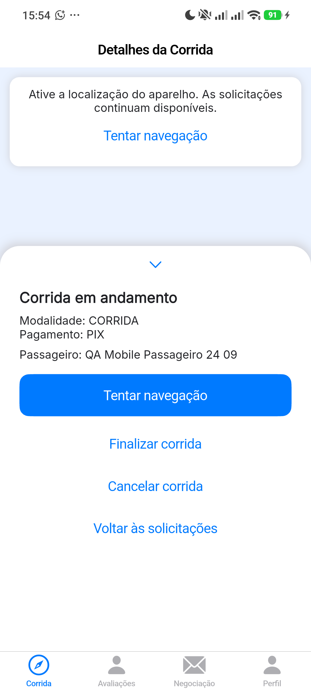

# QA manual no celular: Google Navigation e recuperação

- **Data:** 24/09/2026
- **Aparelho:** Xiaomi 2409FPCC4G, Android 16
- **Aplicativo:** APK debug da branch `feature/autenticacao-seguranca`, com a correção `e92b549`
- **Ambiente:** API de staging em `https://routepires.otavio.win`

O aplicativo foi instalado e operado no celular físico. As duas contas e as duas corridas desta rodada foram criadas na API apenas como preparação, com dados sintéticos; login, seleção da corrida, início, retry, finalização, cancelamento e logout foram realizados na interface. Não foram criados nem executados testes unitários ou scripts de teste.

| Jornada | Resultado observado | Estado |
|---|---|---|
| Abrir APK e entrar como mototaxista | A tela de login abriu; o login exibiu a aba Corrida. | **Passou** |
| Restaurar sessão | Após fechar e reabrir o app, a sessão do mototaxista voltou e a corrida atribuída apareceu na lista. | **Passou** |
| Mapa nativo | A câmera inclinada exibiu edifícios em 3D no aparelho. | **Passou** |
| Iniciar a primeira corrida | A interface mostrou “Em Navegação”, instruções de conversão, trajeto, distância e tempo estimado. A navegação partiu da posição do aparelho para pontos sintéticos em Goiânia; o percurso não foi percorrido fisicamente. | **Passou** |
| Finalizar a primeira corrida | O botão retirou a corrida da lista. A consulta posterior à API retornou `FINALIZADO`. | **Passou** |
| Abrir com a localização do aparelho desligada | O mapa ficou indisponível e apareceu “Ative a localização do aparelho”. A lista e os detalhes da segunda corrida continuaram acessíveis, sem carregamento infinito. | **Passou** |
| Iniciar a segunda corrida sem localização | A tela mudou para “Corrida em andamento”, com opções de tentar a navegação, finalizar, cancelar e voltar à lista. A API confirmou `ANDAMENTO` mesmo sem iniciar o mapa. | **Passou** |
| Religá-la e tentar a navegação novamente | O botão “Tentar navegação” iniciou o Google Navigation e voltou a mostrar o mapa 3D e as instruções. | **Passou** |
| Cancelar a segunda corrida e sair | O cancelamento retirou a corrida da lista; a API retornou `CANCELADO`. O logout voltou ao login e deixou a disponibilidade do mototaxista desligada. | **Passou** |

## Evidência da falha controlada

As capturas do mapa em navegação ficaram somente no workspace local porque mostram a localização do aparelho físico. A falha controlada foi o desligamento do serviço de localização **antes** da inicialização; ela valida a recuperação do aplicativo, mas não reproduz os erros internos `NOT_AUTHORIZED` ou `TERMS_NOT_ACCEPTED` do SDK. Os Termos do Google já estavam aceitos no aparelho e a recusa não foi repetida nesta rodada.

## Dados de QA deixados no staging

| Registro | Identificador | Estado final |
|---|---|---|
| Passageiro `qa-mobile-passenger-20260924-40aa4c25@example.com` | `MGKfbAEeKoa8dWJmiuBc` | Conta sintética permanece. |
| Mototaxista `qa-mobile-driver-20260924-e6104820@example.com` | `tDs9p9YEAvrTWIj2vAG6` | Conta sintética permanece, indisponível e desconectada do celular. |
| Primeira corrida | `QmsmVaTGLlgl9cfeZygm` | `FINALIZADO` |
| Segunda corrida | `tEVh9M4t2VDfpTbk6uqP` | `CANCELADO` |

A senha das contas de QA está guardada somente no arquivo local fora do Git. A localização do aparelho foi religada ao fim da verificação.
